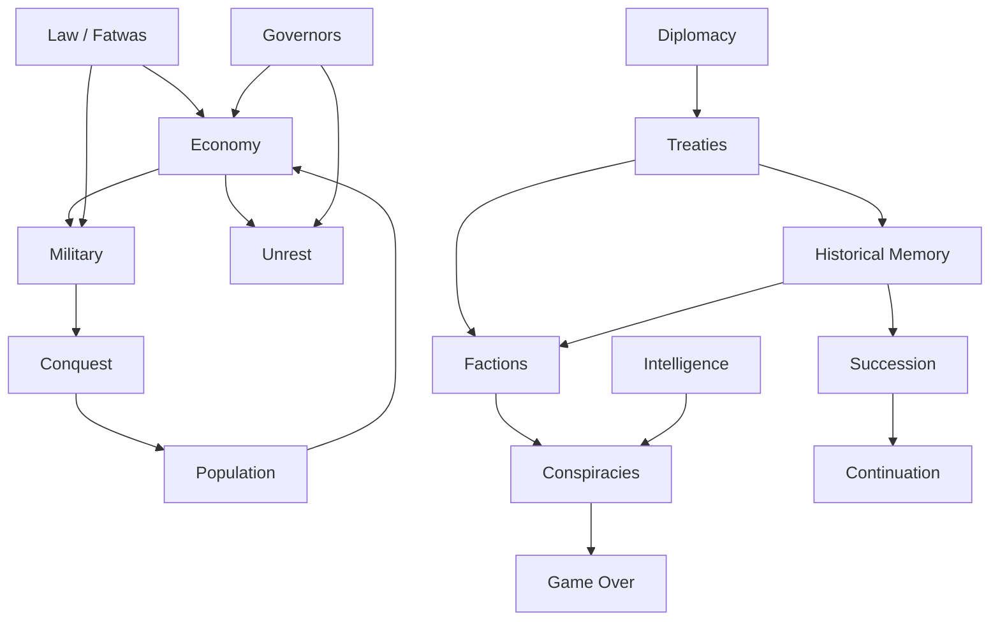

# Bay'at al-Gharb / Western Allegiance
## Game Design Document (GDD) v1.0
**Engine:** Godot 4.x  
**Document status:** Production baseline  
**Last updated:** 5 August 2026  
**Companion document:** [GDD_EVENTS_AND_LESSONS.md](./GDD_EVENTS_AND_LESSONS.md)

---

## Table of Contents

1. [Final Game Title](#1-final-game-title)
2. [Alternative Titles](#2-alternative-titles)
3. [One-Sentence Pitch](#3-one-sentence-pitch)
4. [Full Game Overview](#4-full-game-overview)
5. [Target Audience](#5-target-audience)
6. [Player Fantasy](#6-player-fantasy)
7. [Design Pillars](#7-design-pillars)
8. [Historical and Alternative-History Premise](#8-historical-and-alternative-history-premise)
9. [Full Fictional Biography of Starting Caliph](#9-full-fictional-biography-of-starting-caliph)
10. [Opening Political Situation](#10-opening-political-situation)
11. [Opening Map](#11-opening-map)
12. [Provinces and Cities](#12-provinces-and-cities)
13. [Main Gameplay Loop](#13-main-gameplay-loop)
14. [Time System](#14-time-system)
15. [Map System](#15-map-system)
16. [Military System](#16-military-system)
17. [Conquest System](#17-conquest-system)
18. [Economy](#18-economy)
19. [Administration](#19-administration)
20. [Governors](#20-governors)
21. [Islamic Legal System](#21-islamic-legal-system)
22. [Scholars and Fatwas](#22-scholars-and-fatwas)
23. [Courts and Punishments](#23-courts-and-punishments)
24. [Population](#24-population)
25. [Slavery and Captives](#25-slavery-and-captives)
26. [Factions](#26-factions)
27. [Characters](#27-characters)
28. [Conspiracies](#28-conspiracies)
29. [Intelligence](#29-intelligence)
30. [Diplomacy](#30-diplomacy)
31. [Treaties and Promises](#31-treaties-and-promises)
32. [Historical Memory](#32-historical-memory)
33. [Succession](#33-succession)
34. [Choice System](#34-choice-system)
35. [Difficulty](#35-difficulty)
36. [Tutorial](#36-tutorial)
37. [Educational System](#37-educational-system)
38. [Historical Quotation System](#38-historical-quotation-system)
39. [User Interface](#39-user-interface)
40. [Technical Architecture](#40-technical-architecture)
41. [Database Structure](#41-database-structure)
42. [AI Usage](#42-ai-usage)
43. [Performance Optimization](#43-performance-optimization)
44. [MVP](#44-mvp)
45. [Development Roadmap](#45-development-roadmap)
46. [Monetization](#46-monetization)
47. [Modding](#47-modding)
48. [Main Project Risks](#48-main-project-risks)
49. [Balancing Principles](#49-balancing-principles)
50. [Example of First Hour](#50-example-of-first-hour)
51. [First Ten Major Decisions](#51-first-ten-major-decisions)
52. [Forty Complete Event Examples](#52-forty-complete-event-examples)
53. [Fifty Historical Lesson Examples](#53-fifty-historical-lesson-examples)
54. [Five Alternative-History Campaign Developments](#54-five-alternative-history-campaign-developments)
55. [Example Natural-Death Succession](#55-example-natural-death-succession)
56. [Example Successful Coup Game Over](#56-example-successful-coup-game-over)
57. [Example City Surrender Treaty](#57-example-city-surrender-treaty)
58. [Example Legal Consultation with Dalil](#58-example-legal-consultation-with-dalil)
59. [Example Military Campaign](#59-example-military-campaign)
60. [Final Prioritized Development Checklist](#60-final-prioritized-development-checklist)

**Appendices:** A. Systems Interaction | B. Starting Values | C. Content Pipeline

---

## 1. Final Game Title

**Bay'at al-Gharb** (Arabic: بيعة الغرب)  
**English subtitle:** *Western Allegiance*

The title foregrounds the game's central political fracture: a western bayʿah (pledge of allegiance) taken without Damascus recognition. Players encounter the Arabic title on the title screen; the English subtitle appears in store listings and accessibility settings.

---

## 2. Alternative Titles

| Title | Rationale | Rejected because |
|-------|-----------|------------------|
| *Emir of the Far West* | Clear ruler fantasy | Implies recognized emirate status |
| *Seville, 717* | Strong date anchor | Too narrow; campaign may relocate capital |
| *The Unrecognized Caliph* | Dramatic hook | Spoils mid-game recognition arcs |
| *Wadi al-Hajar* | Battle name recognition | Obscure without context |
| *Al-Andalus: Broken Bay'ah* | SEO-friendly | Overlaps existing Andalus titles |
| *The Western Pact* | Accessible English | Loses Arabic identity |

**Decision:** Keep *Bay'at al-Gharb / Western Allegiance* as canonical. Alternative titles reserved for DLC codenames only.

---

## 3. One-Sentence Pitch

Lead a disputed western Islamic polity in 717 CE—balance conquest, law, faction politics, and succession without exile or second chances when your rule ends by coup, conquest, collapse, capture, or loss of all territory.

---

## 4. Full Game Overview

**Genre:** Historical grand-strategy / ruler simulation  
**Perspective:** Top-down strategic map with province-level management  
**Session length:** 3–15 hours per campaign; multi-generation possible via natural-death succession only  
**Platform:** PC (Windows, Linux; macOS stretch)  
**Input:** Mouse + keyboard primary; partial gamepad support post-MVP  

### Core Experience

The player governs as **Abu al-Mundhir Yahya ibn Abd al-Aziz al-Qaysi**, a fictional Qaysi commander who receives a contested western bayʿah after the Maghreb courier network collapses and the Damascus-appointed governor-designate dies en route. Victory at the fictional **Battle of Wadi al-Hajar** secures local military loyalty but not Umayyad central recognition.

The campaign spans decades of administration, military campaigning, legal adjudication, and dynastic management across roughly **32 provinces** and **20 named cities** in early al-Andalus and adjacent territories. Three troop types—**Infantry, Cavalry, Archers**—support a conquest model emphasizing supply, siege, and commander loyalty over unit micromanagement.

**Game over** occurs on: successful coup, foreign conquest, state collapse, ruler capture, or holding zero provinces. There is **no exile mechanic**—defeat is terminal. **Continuation** requires natural death followed by successful succession planning.

**Monetization:** Premium purchase (no microtransactions, no season pass).

---

## 5. Target Audience

| Segment | Profile | Appeal |
|---------|---------|--------|
| Primary | Ages 22–45, grand-strategy players (CK3, EU4, Old World) | Deep systems, meaningful choices, replayability |
| Secondary | History educators and students (16+) | Verified vs. fictional tagging, lesson system |
| Tertiary | Islamic history enthusiasts | Legal, scholarly, and administrative authenticity |
| Excluded | Mobile casual, RTS twitch players | Deliberate pacing, reading-heavy events |

**Content rating target:** PEGI 16 / ESRB Teen for war, slavery, judicial punishment, and political violence depicted textually and via map abstraction (no graphic gore).

---

## 6. Player Fantasy

You are a **commander elevated beyond your mandate**—not a chosen caliph, but a man who must *become* legitimate through governance, victory, and survival.

The fantasy has four beats:

1. **Usurper's burden** — Every decree is scrutinized; Damascus denies you; local factions measure your worth.
2. **Scholar-commander** — Law is not flavor text; fatwas constrain war, taxation, and treatment of captives.
3. **Dynastic architect** — You may die naturally; your heir inherits your compromises and enemies.
4. **Historical weight** — Chronicle entries record your reign for successors; memory systems punish inconsistency.

You do **not** customize the starting ruler. Identity, age (34), and family ties are fixed narrative anchors.

---

## 7. Design Pillars

### Pillar 1: Legitimacy Is Earned, Not Selected
Recognition from Damascus, scholars, tribes, and cities must be won through play. No legitimacy slider cheat; contradictions surface as events.

### Pillar 2: Law Governs Power
The Islamic legal layer can block, delay, or reshape military and economic actions. Ignoring law raises short-term gains and long-term conspiracy risk.

### Pillar 3: Factions Have Memory
Ten persistent factions track promises, insults, and patronage across decades. Temporary bribery without structural settlement fails.

### Pillar 4: Failure Is Final
No reload-exile, no rump-state refuge. Coup and conquest end the campaign. This raises stakes for compromise vs. principle.

### Pillar 5: History With Honest Boundaries
Verified history, disputed scholarship, and deliberate fiction are **tagged in UI** and in educational entries. No fabricated Qur'an verses or hadith.

---

## 8. Historical and Alternative-History Premise

### Tagging Convention (used throughout)

| Tag | Meaning |
|-----|---------|
| **[VERIFIED]** | Broad scholarly consensus; primary sources cited where possible |
| **[DISPUTED]** | Credible scholarly disagreement or sparse sources |
| **[FICTIONAL]** | Invented for gameplay; no claim to historical fact |

### Verified Historical Frame [VERIFIED]

- **717 CE / 12 Rajab 98 AH:** Umayyad Caliphate under **Al-Walid I** (d. 715) succeeded by **Sulayman ibn Abd al-Malik** (r. 715–717). Sulayman's reign is historically attested; specific western appointments in this year are partially documented but not at the granularity this game requires.
- **Al-Andalus** in the early 8th century was under Umayyad provincial administration following the 711–716 conquest period. **Seville (Ishbiliya)** was a significant urban center.
- Military forces of the period included **infantry, cavalry, and archers** as broad categories; the game abstracts finer troop distinctions.
- **Bayʿah** as a pledge of allegiance is a well-attested Islamic political institution.
- **Damascus** as caliphal capital for the Umayyads [VERIFIED].

### Disputed or Sparse [DISPUTED]

- Exact administrative boundaries of early al-Andalus provinces in 717.
- Identity and career of every regional commander; many names are lost or later-embellished.
- Extent of central control vs. local autonomy in the years immediately after initial conquest waves.

### Alternative-History Divergence [FICTIONAL]

| Event | Fictional premise |
|-------|-------------------|
| Maghreb courier collapse | A coordinated breakdown of imperial dispatch routes isolates the west for 18+ months |
| Death of governor-designate | **Abd al-Rahman ibn Uqbah al-Fihri** (fictional composite name—not to be confused with historical figures without explicit note) dies near the straits with sealed credentials |
| Battle of Wadi al-Hajar | Fictional engagement north of Seville; Yahya defeats a coalition of holdout Visigothic lords and dissenting Berber clients |
| Western bayʿah | Notables of Ishbiliya and allied commanders pledge to Yahya **without** Damascus confirmation |
| Non-recognition | Caliph Sulayman's court issues no formal appointment; western polity is **de facto** autonomous |

**Design rule:** Alt-history branches remain plausible to 8th-century material conditions (no gunpowder, no industrial economy).

---

## 9. Full Fictional Biography of Starting Caliph

**[FICTIONAL CHARACTER — all biographical details below]**

### Identity

| Field | Value |
|-------|-------|
| **Kunya** | Abu al-Mundhir |
| **Name** | Yahya ibn Abd al-Aziz ibn Hisham al-Qaysi |
| **Arabic** | يحيى بن عبد العزيز بن هشام القيسي |
| **Age at start** | 34 (born ~683 CE / ~63 AH) |
| **Lineage** | Qaysi faction; grandfather Hisham served in Syrian garrison logistics [fictional] |
| **Customizable** | **No** |

### Early Life [FICTIONAL]

Born in the Jund al-Urdunn mustering towns, Yahya trained in cavalry scouts and dispatch riding. His father Abd al-Aziz died in a plague year (~698 CE), leaving modest property and debt. Yahya entered Umayyad western service ~702 CE as a **katib-cavalry officer** attached to supply columns crossing North Africa.

### Rise in the West [FICTIONAL]

- **705–710:** Distinguished in suppression of Berber revolt pockets (fictional operations in central Maghreb).
- **712:** Present during early crossing operations into al-Andalus; noted for disciplined loot accounting.
- **714–716:** Appointed **qa'id** of Seville's outer garrisons; builds reputation for paying troops on time when central silver arrives late.
- **Early 717:** When courier collapse strands imperial orders, Yahya is senior surviving officer in Ishbiliya after the governor-designate's death.

### Personality Profile (gameplay traits)

| Trait | Game effect |
|-------|-------------|
| **Measured** | +10% negotiation success; slower outrage buildup |
| **Qaysi partisan** | Bonus with Qaysi faction; malus with rival Yemeni networks |
| **Ledger-minded** | +5% tax efficiency; events reference written accounts |
| **Unrecognized** | Permanent diplomacy malus with Damascus until recognition arc completes |

### Family [FICTIONAL]

- **Wife:** Umm Khalid bint Jarir al-Ash'arī — political marriage linking Ash'arī urban notables
- **Heir (age 12):** Mundhir — eligible for succession training
- **Brother:** Salim — governor candidate; conspiracy risk if slighted
- **Sister:** Layla — married into a merchant house; trade faction bridge

---

## 10. Opening Political Situation

**Date:** 1 July 717 CE / 12 Rajab 98 AH  
**Capital:** Seville (Ishbiliya)  
**Ruler:** Yahya (contested amir; not caliph in Damascus' eyes)

### Power Distribution at Start

| Bloc | Stance | Strength |
|------|--------|----------|
| Damascus court | Non-recognition; demands obedience | Diplomatic pressure, legitimacy |
| Seville urban notables | Conditional support | Tax, unrest |
| Qaysi military clients | Strong support | Army cohesion |
| Yemeni commanders | Suspicious | Coup risk |
| Berber federates | Negotiated autonomy | Cavalry, revolt |
| Visigothic holdouts | Hostile | Northern raids |
| Jewish communities | Neutral-pragmatic | Finance, urban stability |
| Christian dhimmi | Wary | Agriculture, tribute |
| Scholarly networks | Watching | Fatwas, legitimacy |
| Frankish kingdoms | Opportunistic | Northern threat |

### Immediate Crises

1. **Unfinished conquest** — Mérida and northern highlands not secured.
2. **Empty treasury** — Courier collapse delayed tax remittance and grain shipments.
3. **Rival bayʿah rumors** — Cordoba faction may elevate an alternative commander.
4. **Imperial silence** — No patent of appointment from Sulayman.

---

## 11. Opening Map

### Geographic Scope

The campaign map covers **Iberia south of the Duero line (partial)**, **Gibraltar straits approaches**, and **coastal Maghreb nodes** relevant to supply—not a full Mediterranean map.

### Starting Control (player)

- **Core:** Seville province + 6 adjacent provinces (see §12)
- **Contested:** 4 provinces with rebel or rival governors
- **Enemy:** 3 Visigothic holdout provinces north/east
- **Neutral:** 2 Frankish-border provinces (event-triggered hostility)

### Map Layers

1. Political control (fill color by faction)
2. Supply routes (grain, silver, horses)
3. Legal schools influence (Hanafi/Maliki presence abstracted)
4. Unrest and plague overlays
5. Army positions (stack icons: Infantry / Cavalry / Archers)

---

## 12. Provinces and Cities

### Provinces (~32)

| # | Province ID | Name | Start controller | Notes |
|---|-------------|------|------------------|-------|
| 1 | `prov_ishbiliya` | Ishbiliya (Seville core) | Player | Capital |
| 2 | `prov_huelva` | Huelva coast | Player | Naval access |
| 3 | `prov_cadiz` | Qadiz | Player | Salt, fish |
| 4 | `prov_carmona` | Carmona | Player | Granary |
| 5 | `prov_ecija` | Ecija | Player | Cavalry fodder |
| 6 | `prov_osuna` | Osuna | Player | Qaysi estates |
| 7 | `prov_cordoba` | Qurtuba | Rival | Major city |
| 8 | `prov_jaen` | Jayyan | Contested | Olive belt |
| 9 | `prov_granada` | Granada | Berber ally | Mountain |
| 10 | `prov_malaga` | Malaqa | Player vassal | Port |
| 11 | `prov_algeciras` | Al-Jazira al-Khadra | Neutral | Straits |
| 12 | `prov_ronda` | Ronda | Berber | Pass fort |
| 13 | `prov_murcia` | Mursiya | Player | Irrigation |
| 14 | `prov_lorca` | Lorca | Contested | Mining |
| 15 | `prov_valencia` | Balansiya | Rebel | Fertile |
| 16 | `prov_tortosa` | Turtusha | Visigothic | Border |
| 17 | `prov_zaragoza` | Saraqusta | Neutral | Frankish pressure |
| 18 | `prov_merida` | Marida | Visigothic | Unfinished conquest |
| 19 | `prov_badajoz` | Badajoz | Visigothic | Fortress |
| 20 | `prov_plasencia` | Plasencia | Visigothic | Highland |
| 21 | `prov_toledo` | Tulaytula | Visigothic | Symbolic |
| 22 | `prov_beja` | Baja | Contested | Transhumance |
| 23 | `prov_evora` | Evora | Neutral | Lusitanian edge |
| 24 | `prov_coimbra` | Qulumriya | Visigothic | Northern |
| 25 | `prov_ceuta` | Sabta | Imperial claim | Maghreb bridge |
| 26 | `prov_tangier` | Tanja | Delayed convoy | Supply hub |
| 27 | `prov_fez` | Fas hinterland | Notional | Off-map pressure |
| 28 | `prov_algarve` | Al-Gharb | Player | Name-source region |
| 29 | `prov_guadalquivir` | Guadalquivir floodplain | Player | Event-heavy |
| 30 | `prov_sierra` | Sierra Morena | Rebel | Bandits |
| 31 | `prov_levante` | Levante coast | Rebel | Naval raids |
| 32 | `prov_duero` | Duero march | Frankish | Late-game |

### Cities (~20)

| City | Province | Type | Specialization |
|------|----------|------|----------------|
| **Seville** | Ishbiliya | Capital | Administration, bayʿah site |
| **Cordoba** | Qurtuba | Rival capital | Scholarship, prestige |
| **Granada** | Granada | Fortress-city | Mountain trade |
| **Malaga** | Malaqa | Port | Naval, trade |
| **Algeciras** | Al-Jazira | Port | Straits control |
| **Murcia** | Mursiya | Agricultural | Grain |
| **Valencia** | Balansiya | Rebel city | Silk, unrest |
| **Tortosa** | Turtusha | Border | River crossing |
| **Zaragoza** | Saraqusta | Frontier | Frankish diplomacy |
| **Merida** | Marida | Siege target | Visigothic seat |
| **Badajoz** | Badajoz | Fortress | Stone walls |
| **Toledo** | Tulaytula | Symbolic | Legitimacy prize |
| **Cadiz** | Qadiz | Port | Salt |
| **Carmona** | Carmona | Granary | Food security |
| **Ecija** | Ecija | Cavalry | Horse markets |
| **Lorca** | Lorca | Mining | Iron |
| **Ronda** | Ronda | Pass | Berber ties |
| **Ceuta** | Sabta | Exclave | African supply |
| **Tangier** | Tanja | Convoy | Imperial link |
| **Beja** | Baja | Pastoral | Herd wealth |

---

## 13. Main Gameplay Loop

```
┌─────────────────────────────────────────────────────────────┐
│  STRATEGIC TICK (1 week default; pause on events)           │
├─────────────────────────────────────────────────────────────┤
│  1. Receive reports (economy, unrest, military, diplomacy)  │
│  2. Resolve events & choices (may pause)                      │
│  3. Issue decrees (tax, law, appointments) — subject to fatwas│
│  4. Move armies / assign governors / negotiate treaties       │
│  5. Advance time → consequences & delayed hooks fire        │
│  6. Check failure conditions & succession triggers          │
└─────────────────────────────────────────────────────────────┘
```

### Micro-Loops Within the Week

- **Administration:** balance treasury vs. unrest vs. faction favor
- **Military:** supply → march → siege/battle → occupation integration
- **Legal:** consult scholars before controversial decrees
- **Intelligence:** uncover conspiracies; verify accusations
- **Dynastic:** train heir, manage family marriages

---

## 14. Time System

### Hybrid Calendar

The game displays **dual dates** everywhere:

| System | Use |
|--------|-----|
| **Gregorian (proleptic)** | Player familiarity, Steam achievements |
| **Hijri** | In-world decrees, chronicle flavor |

**Conversion:** Fixed astronomical approximation for campaign (not historical calendar reform debates). Example start: **1 July 717 CE = 12 Rajab 98 AH**.

### Tick Structure

| Speed | Real time / tick | Game time / tick |
|-------|------------------|------------------|
| Pause | — | Event modals |
| Normal | 2 sec | 1 week |
| Fast | 0.5 sec | 1 week |
| Blitz | 0.1 sec | 1 week (auto-resolve battles simplified) |

**Seasons:** Abstracted as quarterly modifiers (harvest Q3, winter supply strain Q1).

---

## 15. Map System

### Province Graph

- Provinces are **nodes**; adjacency defines movement and supply.
- **Terrain tags:** coastal, mountain, river, plain, forest — affect march speed and archer bonus.
- **Fort levels 0–3:** additive siege duration.

### Supply Lines

Armies consume **grain + pay** per week. Cut supply → attrition → desertion events.

### Fog of War

- **Military fog:** enemy army sizes approximate until scout reports.
- **Political fog:** hidden conspiracy progress until intelligence investment.

### Capital Rules

- Losing capital does **not** instant game-over but triggers **crisis events** (relocation, legitimacy collapse).
- **Zero provinces** = game over.

---

## 16. Military System

### Unit Types (only three)

| Type | Role | Counter | Upkeep |
|------|------|---------|--------|
| **Infantry** | Siege, hold terrain | Cavalry (if flanked) | Low |
| **Cavalry** | Shock, pursuit, raid | Archers (terrain) | High |
| **Archers** | Skirmish, siege defense | Infantry (melee) | Medium |

### Army Composition

- Armies are **stacks** with min 100 / soft cap 3,000 abstract strength per field army.
- **Commanders** have loyalty, popularity, and faction tags — independent of unit type.

### Battle Resolution

1. **Auto-resolve** using composition, terrain, commander stats, supply, morale.
2. **Pre-battle choices** (flank, hold, charge) modify modifiers — not tactical RTS.
3. **Pyrrhic victory** possible: win province but lose elite cavalry → events.

### Recruitment

- **Infantry:** provincial levies (fast, low quality)
- **Cavalry:** Berber federates + horse markets (slow, faction-dependent)
- **Archers:** urban militia + tribal hunters

---

## 17. Conquest System

### Paths to Control

| Method | Duration | Unrest | Legitimacy |
|--------|----------|--------|------------|
| **Field battle victory** | Fast | High | Military |
| **Siege** | Slow | Medium | Mixed |
| **Negotiated surrender** | Variable | Lower | Diplomatic |
| **Internal revolt flip** | Instant | Low if promised | Fragile |

### Integration Timer

New provinces pass through:

1. **Occupied** (0–12 weeks) — loot risk, commander autonomy
2. **Pacified** (12–52 weeks) — governor appointment required
3. **Integrated** — full tax; can build fort

### Unfinished Conquest Flag

Provinces marked **unfinished** at start (e.g., Merida) grant legitimacy if completed but drain prestige if abandoned.

---

## 18. Economy

### Core Resources

| Resource | Source | Use |
|----------|--------|-----|
| **Silver (dirham abstract)** | Tax, trade, loot | Pay, construction |
| **Grain** | Farms, imports | Army + cities |
| **Horses** | Markets, tribute | Cavalry recruitment |
| **Prestige** | Victories, law, bayʿah | Diplomacy, succession |
| **Legitimacy** | Recognition, scholars | Decree acceptance |

### Formulas (weekly)

```
Tax_Income = Σ(prov_tax_base × governor_efficiency × (1 - unrest_penalty) × law_modifier)

prov_tax_base = population × per_capita_rate × prosperity

unrest_penalty = clamp(unrest / 100, 0, 0.6)

Army_Cost = (inf × 0.5) + (cav × 2.0) + (arc × 1.0)  [silver/week]

Grain_Need = (army_strength × 0.01) + (city_pop × 0.001)

Loot = siege_success ? (prov_wealth × loot_fraction × commander_loyalty_modifier) : 0
```

**Loot_fraction** default 0.15; fatwas and promises can cap or forbid.

**Trade income:** `port_level × trade_route_status × 50` silver/week.

**Deficit effects:** unpaid troops → mutiny events; grain shortage → unrest + plague risk.

---

## 19. Administration

### Decree Types

- Tax adjustment (−/+/ special levy)
- Grain reserve release / purchase
- Fort construction
- Road patrol (bandit suppression)
- Census (unlocks accuracy; raises unrest)

### Capacity

**Administrative points (AP):** 3/week base + governor bonuses. Decrees cost AP.

### Corruption

Hidden provincial **corruption** 0–100; governors and audits modify. High corruption → false revenue reports.

---

## 20. Governors

### Appointment

Governors chosen from **character pool** — family, commanders, scholars, locals.

| Stat | Effect |
|------|--------|
| **Competence** | Tax, unrest |
| **Loyalty** | Coup, rebellion |
| **Greed** | Corruption, skim |
| **Piety** | Legal compliance |
| **Faction** | Local faction relations |

### Rotation vs. Tenure

- Short rotations: lower corruption, higher transition cost
- Long tenure: stability until entrenchment events

### Player brother Salim

Starts as eligible governor for Carmona; rival path if passed over.

---

## 21. Islamic Legal System

### Schools (abstracted)

Campaign defaults to **early Maliki/Hanafi mix** as in western Umayyad practice [DISPUTED historically at this exact date — flagged in lessons].

### Legal Domains

| Domain | Governs |
|--------|---------|
| **War & spoils** | Loot division, captive treatment |
| **Taxation** | kharaj, jizya rates, emergency levies |
| **Judiciary** | Appointment of qadi |
| **Social** | Dhimmi obligations, public order |
| **Slavery** | Ransom, manumission rules |

### Mechanic: **Compliance Score**

0–100; controversial decrees without consultation reduce score → scholar criticism events.

**Critical rule:** Game never fabricates Qur'an text or hadith. Legal opinions cite **verified reference IDs** (see §38, supplement citation rules).

---

## 22. Scholars and Fatwas

### Scholar Characters

Each scholar has:

- **School affiliation**
- **Reputation**
- **Relationship to ruler**
- **Memory of past rulings**

### Fatwa Workflow

1. Player proposes action (e.g., sack city)
2. Optional: request fatwa
3. Scholar returns **permissible / discouraged / forbidden** with conditions
4. Player may proceed anyway → **precedent flag** stored

### Dalil (legal guide)

Tutorial and mid-game **dalil** character explains citations in plain language — see §58.

---

## 23. Courts and Punishments

### Case Types

- Criminal (theft, murder, brigandage)
- Political (sedition, false bayʿah)
- Intercommunal (dhimmi-Muslim disputes)
- Military (desertion, disobedience)

### Punishment Menu

| Punishment | Effect |
|------------|--------|
| Fine | Treasury + unrest |
| Imprisonment | Removes character; jailbreak risk |
| Exile (NPC only) | Not available to player ruler |
| Execution | Deterrence; faction outrage |
| Restitution | Legitimacy + cost |

**Player ruler** cannot be subject to player-chosen punishment — capture by enemy = game over.

---

## 24. Population

### Population Classes (abstract)

| Class | Role |
|-------|------|
| Muslim settlers | Tax base, recruitment |
| Convert communities | Unrest sensitive |
| Dhimmi | Jizya, specialized labor |
| Slaves | Estate production, ransom |
| Tribal pastoralists | Cavalry, autonomy |

### Unrest Drivers

- Tax spikes, food shortage, broken promises, religious disputes, plague.

### Migration Events

Voluntary and forced relocation — affects province population and unrest.

---

## 25. Slavery and Captives

### Distinction

| Category | Source | Mechanics |
|----------|--------|-----------|
| **Captives of war** | Battles, sieges | Ransom, enslavement, manumission events |
| **Existing slavery** | Province baseline | Production, social tension |

### Ethical Design

- System is **historical, not endorsing**; lessons address Islamic rulings on captives with sourced citations.
- **Manumission** paths affect legitimacy and scholar approval.
- Forced enslavement of dhimmi forbidden by default fatwa — violation triggers events.

---

## 26. Factions

**Ten factions** — persistent, memory-enabled:

| # | Faction ID | Name | Focus |
|---|------------|------|-------|
| 1 | `fac_damascus` | Damascus Court | Recognition, tribute |
| 2 | `fac_qaysi` | Qaysi Commanders | Military primacy |
| 3 | `fac_yemeni` | Yemeni Officers | Rival military bloc |
| 4 | `fac_berber` | Berber Federates | Autonomy, cavalry |
| 5 | `fac_ashari` | Ash'arī Urban Notables | Seville-Cordoba politics |
| 6 | `fac_scholars` | Scholarly Network | Law, legitimacy |
| 7 | `fac_merchants` | Coastal Merchants | Trade, stability |
| 8 | `fac_dhimmi` | Dhimmi Councils | Tolerance, jizya |
| 9 | `fac_visigothic` | Visigothic Holdouts | Reconquest (enemy) |
| 10 | `fac_franks` | Frankish Kingdoms | Northern threat |

### Favor

−100 to +100; affects event availability, coup thresholds, and treaty viability.

---

## 27. Characters

### Starting Roster (~24)

| ID | Name | Role | Faction |
|----|------|------|---------|
| `chr_yahya` | Yahya al-Qaysi | Player ruler | Qaysi |
| `chr_umm_khalid` | Umm Khalid | Consort | Ash'arī |
| `chr_mundhir` | Mundhir (12) | Heir | Qaysi |
| `chr_salim` | Salim | Brother | Qaysi |
| `chr_layla` | Layla | Sister | Merchants |
| `chr_ibn_hud` | Ibn Hud al-Yamani | Rival commander | Yemeni |
| `chr_nusayba` | Nusayba bint Malik | Cordoba notable | Ash'arī |
| `chr_tariq_berber` | Tariq al-Zanata | Berber leader | Berber |
| `chr_abd_wahid` | Abd al-Wahid | Chief qadi candidate | Scholars |
| `chr_yusuf_katib` | Yusuf the Scribe | Treasurer | Ash'arī |
| `chr_hassan_scout` | Hassan al-Farisi | Intelligence chief | Qaysi |
| `chr_roderic_hold` | Roderic (fictional) | Visigothic leader | Visigothic |
| `chr_egilo` | Egilo | Frankish envoy | Franks |
| `chr_sulayman_proxy` | Imperial envoy Maslama (fictional) | Damascus voice | Damascus |
| `chr_zaynab` | Zaynab | Merchant syndicate | Merchants |
| `chr_elias` | Elias ibn Nuri | Dhimmi elder | Dhimmi |
| `chr_fatima` | Fatima al-Malika | Scholar | Scholars |
| `chr_umar_raider` | Umar al-Ghazi | Popular general | Qaysi |
| `chr_khalid_corrupt` | Khalid ibn Rumi | Corrupt governor | Yemeni |
| `chr_asma` | Asma | Harem political node | Ash'arī |
| `chr_jabir` | Jabir | Assassin suspect | — |
| `chr_pelagius` | Pelagius (fictional precursor) | Mountain rebel | Visigothic |
| `chr_ismail` | Ismail | Slave broker | Merchants |
| `chr_nasir` | Nasir | Palace guard captain | Qaysi |

Characters age, die, and are replaced via events.

---

## 28. Conspiracies

### Conspiracy Object Types

- **Coup** — replace ruler
- **Secession** — province breaks away
- **Assassination** — ruler death (game over if successful)
- **Sabotage** — treasury, supply, gates

### Progress Model

Hidden **0–100 progress**; intelligence actions reveal bands:

- 0–25: Rumors
- 26–50: Named suspects
- 51–75: Evidence choices
- 76–100: Imminent — counter-coup window

### Drivers

Low pay, broken treaties, faction neglect, false accusations, rival popularity.

---

## 29. Intelligence

### Actions (cost silver + AP)

| Action | Effect |
|--------|--------|
| Scout province | Army/rebel info |
| Infiltrate court | Conspiracy progress |
| Bribe clerk | Corruption evidence |
| Counter-intelligence | Reduce assassination risk |

### Reliability

Reports carry **confidence %** — disputed evidence events force choices on incomplete data.

---

## 30. Diplomacy

### Interlocutors

Damascus, Frankish kingdoms, Berber tribes, Visigothic holdouts, rival Andalusi commanders, merchant leagues.

### Actions

- Send tribute / request recognition
- Non-aggression pact
- Marriage alliance (family characters)
- Trade concession
- Threaten / demand surrender

### Recognition Track

0–5 stages from **Usurper** to **Imperial Appointment** — never guaranteed.

---

## 31. Treaties and Promises

### Treaty Structure

Each treaty records:

- **Parties** (faction IDs)
- **Terms** (tribute, passage, non-raid, prisoner exchange)
- **Duration** (weeks or until broken)
- **Witnesses** (scholar/notable — affects enforceability)
- **Penalty clause** (prestige, territory)

### Promises (soft treaties)

Player verbal promises to characters/factions stored in **memory system** — breaking them without formal treaty still applies favor penalties.

### Broken Treaty Cascade

1. Immediate favor collapse with victim faction
2. **Historical memory** entry (+20% conspiracy progress with allies of victim)
3. Event chain: retaliation, embargo, or invasion

See §57 for city surrender treaty example.

---

## 32. Historical Memory

### Memory Entries

Structured records:

```json
{
  "id": "mem_0142",
  "actor": "chr_yahya",
  "action": "broke_siege_promise_balansiya",
  "turn": 412,
  "witnesses": ["fac_merchants", "fac_scholars"],
  "decay_halflife_weeks": 260
}
```

### Effects

- Factions with memory reference past actions in event text and modifiers
- **Heir inherits** uncleared memories at 50% weight
- Chronicle compiles memories into end-of-reign summary

---

## 33. Succession

### Continuation Rules

| Outcome | Campaign continues? |
|---------|---------------------|
| Natural death + valid heir + successful bayʿah | **Yes** |
| Assassination | **No** (game over) |
| Coup | **No** |
| Capture | **No** |
| Zero territory | **No** |

### Heir Requirements

- **Designated heir** (default: Mundhir)
- **Succession bayʿah** event within 12 weeks of death
- Minimum **legitimacy** threshold (difficulty-scaled)

### Failed Succession

If bayʿah fails → **collapse game over** (not playable rival ruler).

See §55 for natural-death example.

---

## 34. Choice System

### Choice Anatomy

Every major choice includes:

- **4–8 options** (event supplement standard)
- **Visible tags:** Legal, Military, Economic, Faction (color-coded)
- **Hidden consequences** flagged only on Historian difficulty
- **Delayed hooks** (fire weeks/months later)

### Constraint Types

| Constraint | Example |
|------------|---------|
| Hard block | Fatwa forbidden |
| Soft block | Option grayed if treasury < cost |
| Reputation lock | Needs +30 Qaysi favor |

### No Take-Backs

Decisions are **save-locked** on Iron Throne difficulty; standard allows manual save except during event modal.

---

## 35. Difficulty

| Difficulty | Description | Modifiers |
|------------|-------------|-----------|
| **Student** | Learning focus; generous tooltips | +20% income; conspiracy revealed earlier |
| **Governor** | Default balanced | Baseline |
| **Caliph** | Tighter economy, smarter AI | −10% income; +15% unrest from tax |
| **Historian** | Hidden consequence previews off; stricter law | Memory decay halved |
| **Iron Throne** | Ironman, no manual save on events, harsher coups | Coup threshold −15 favor |

---

## 36. Tutorial

### Structure (first 60 in-game weeks)

| Phase | Weeks | Teaches |
|-------|-------|---------|
| **Bayʿah** | 1–4 | Map, time, factions |
| **Ledger** | 5–12 | Tax, grain, pay |
| **First fatwa** | 13–20 | Legal consultation |
| **First siege** | 21–40 | Military, supply |
| **Governor** | 41–52 | Appointment, corruption |
| **Chronicle** | 53–60 | Memory, save habits |

**Dalil** (non-fiction guide character) narrates — distinct from scholar fatwas.

Skippable after week 4 for experienced players.

---

## 37. Educational System

### Lesson Triggers

- Province first visit
- Legal domain first use
- Event aftermath
- Encyclopedia browse

### Lesson Card Fields

- **Anchor** (historical concept)
- **Sources** (academic / primary — no fabricated scripture)
- **Principle** (what player should understand)
- **Limitations** (what game simplifies)
- **Situations** (when rule applies in-game)

**50 full entries** in [GDD_EVENTS_AND_LESSONS.md](./GDD_EVENTS_AND_LESSONS.md).

### Citation Integrity

See supplement **Citation Integrity Rules** — Qur'an and hadith must use verified database IDs; paraphrase only with `PARAPHRASE` flag.

---

## 38. Historical Quotation System

### Quotation Types

| Type | Source requirement |
|------|-------------------|
| **Primary chronicle** | Named medieval source + translation note |
| **Modern scholarship** | Author, year, page/chapter |
| **Scriptural** | Qur'an: surah:ayah from licensed text API; Hadith: collection ID + number |
| **Fictional chronicle** | Tagged `[FICTIONAL CHRONICLE]` |

### Display

Quotations appear in:

- Event intros
- Loading screens
- End-of-reign chronicle
- Lesson cards

**Never** display unverified Arabic scriptural text as authentic.

---

## 39. User Interface

### Layout

```
┌──────────────────────────────────────────────────────────┐
│ Top bar: Date (CE/AH) | Treasury | Grain | Prestige | ⚖ │
├────────────┬─────────────────────────────────────────────┤
│ Side panel │              MAP                          │
│ - Decrees  │         (provinces, armies)               │
│ - Characters│                                            │
│ - Factions │                                             │
│ - Chronicle│                                             │
├────────────┴─────────────────────────────────────────────┤
│ Event / Report drawer (bottom)                           │
└──────────────────────────────────────────────────────────┘
```

### Accessibility

- Font scaling 100–150%
- Colorblind province patterns
- Screen reader labels on critical buttons (post-MVP)
- Arabic names with transliteration toggle

### Chronicle Panel

Auto-generated reign log; exportable as text at game end.

---

## 40. Technical Architecture

### Engine: Godot 4.x

**Chosen over Unity** for:

| Factor | Godot 4.x | Unity |
|--------|-----------|-------|
| **2D map performance** | Strong TileMap, low overhead | Heavier for 2D-only |
| **License cost** | MIT, no revenue share | Subscription / fees |
| **Data-driven design** | JSON + Resources native | Comparable |
| **Team size fit** | Lean pipeline | Larger ecosystem overhead |
| **Linux support** | First-class export | Supported but heavier |

### Stack

| Layer | Technology |
|-------|------------|
| Engine | Godot 4.3+ |
| Language | GDScript (gameplay), C# optional for tools |
| Data | JSON schemas validated at load |
| Save | Compressed JSON + checksum |
| Localization | CSV → Godot TranslationServer |
| Version control | Git; LFS for art |

### Project Structure

```
bayat-al-gharb/
├── assets/          # art, audio, fonts
├── data/            # json schemas
├── scenes/          # map, ui, menus
├── scripts/         # systems
├── localization/
└── tests/           # unit tests for formulas
```

---

## 41. Database Structure

All gameplay data is **JSON** loaded at startup; moddable. Schema version in `data_version.json`.

### Ruler Example

```json
{
  "id": "chr_yahya",
  "schema": "ruler_v1",
  "name_ar": "يحيى بن عبد العزيز بن هشام القيسي",
  "name_en": "Yahya ibn Abd al-Aziz al-Qaysi",
  "kunya": "Abu al-Mundhir",
  "age": 34,
  "health": 82,
  "traits": ["measured", "ledger_minded", "unrecognized"],
  "faction": "fac_qaysi",
  "heir_id": "chr_mundhir",
  "spouse_id": "chr_umm_khalid",
  "customizable": false
}
```

### Character Example

```json
{
  "id": "chr_ibn_hud",
  "schema": "character_v1",
  "name_en": "Ibn Hud al-Yamani",
  "roles": ["commander"],
  "stats": { "competence": 72, "loyalty": 45, "popularity": 68, "piety": 55, "greed": 30 },
  "faction": "fac_yemeni",
  "alive": true
}
```

### Province Example

```json
{
  "id": "prov_ishbiliya",
  "schema": "province_v1",
  "name_en": "Ishbiliya",
  "controller": "player",
  "tax_base": 420,
  "population": 85000,
  "unrest": 12,
  "corruption": 18,
  "terrain": "plain",
  "fort_level": 2,
  "unfinished_conquest": false
}
```

### City Example

```json
{
  "id": "city_seville",
  "schema": "city_v1",
  "province_id": "prov_ishbiliya",
  "name_en": "Seville",
  "is_capital": true,
  "port_level": 2,
  "specialization": "administration"
}
```

### Army Example

```json
{
  "id": "army_west_1",
  "schema": "army_v1",
  "location_province": "prov_ishbiliya",
  "commander_id": "chr_yahya",
  "strength": { "infantry": 1200, "cavalry": 400, "archers": 600 },
  "supply_weeks": 6,
  "morale": 75
}
```

### Faction Example

```json
{
  "id": "fac_qaysi",
  "schema": "faction_v1",
  "name_en": "Qaysi Commanders",
  "favor": 65,
  "memory_ids": ["mem_0001"]
}
```

### Scholar Example

```json
{
  "id": "chr_fatima",
  "schema": "scholar_v1",
  "school": "maliki_early",
  "reputation": 70,
  "relationship": 50,
  "fatwa_history": []
}
```

### Legal Opinion Example

```json
{
  "id": "legal_0031",
  "schema": "legal_opinion_v1",
  "domain": "war_spoils",
  "ruling": "discouraged",
  "conditions": ["dhimmi_property_protected", "fifth_to_treasury"],
  "citations": [{ "type": "scholarship", "ref": "Donner_2010_p210", "paraphrase": true }],
  "scholar_id": "chr_fatima"
}
```

### Event Example

```json
{
  "id": "evt_unpaid_troops_01",
  "schema": "event_v1",
  "title": "The Empty Pay Chest",
  "trigger": { "treasury_below": 100, "army_size_above": 1500 },
  "choices": ["evt_unpaid_troops_01_a", "evt_unpaid_troops_01_b"],
  "tags": ["military", "economic"]
}
```

### Choice Example

```json
{
  "id": "evt_unpaid_troops_01_a",
  "schema": "choice_v1",
  "text": "Pledge payment from next harvest levy",
  "effects": [{ "type": "favor", "faction": "fac_qaysi", "delta": 5 }],
  "delayed_hooks": ["hook_pay_promise_12w"]
}
```

### Consequence Example

```json
{
  "id": "cons_merida_sack",
  "schema": "consequence_v1",
  "prestige": -15,
  "legitimacy": -10,
  "memory": "mem_sacked_merida",
  "unrest": { "prov_merida": 30 }
}
```

### Delayed Hook Example

```json
{
  "id": "hook_pay_promise_12w",
  "schema": "hook_v1",
  "fire_weeks": 12,
  "condition": { "treasury_below": 200 },
  "event_id": "evt_mutiny_escalation"
}
```

### Treaty Example

```json
{
  "id": "treaty_balansiya_surrender",
  "schema": "treaty_v1",
  "parties": ["player", "city_valencia"],
  "terms": ["no_sack", "jizya_unchanged", "governor_appointment"],
  "duration_weeks": 520,
  "witness_scholar_id": "chr_abd_wahid"
}
```

### Promise Example

```json
{
  "id": "promise_khalid_promotion",
  "schema": "promise_v1",
  "to_character": "chr_khalid_corrupt",
  "text": "Governorship of Lorca within a year",
  "deadline_week": 104,
  "broken_penalty": { "conspiracy": 25 }
}
```

### Memory Example

```json
{
  "id": "mem_sacked_merida",
  "schema": "memory_v1",
  "action": "city_sacked",
  "location": "prov_merida",
  "turn": 88,
  "decay_halflife_weeks": 200
}
```

### Conspiracy Example

```json
{
  "id": "cosp_yemeni_coup",
  "schema": "conspiracy_v1",
  "type": "coup",
  "progress": 35,
  "mastermind_id": "chr_ibn_hud",
  "discovered": false
}
```

### Economy Snapshot Example

```json
{
  "id": "econ_week_44",
  "schema": "economy_v1",
  "treasury": 340,
  "grain_stores": 1200,
  "weekly_income": 85,
  "weekly_expense": 92
}
```

### Quotation Example

```json
{
  "id": "quote_donner_conquest",
  "schema": "quotation_v1",
  "type": "scholarship",
  "text_en": "The early Islamic conquests were not merely military events but administrative transformations.",
  "source": "Donner, F.M., Muhammad and the Believers (2010)",
  "verified": true
}
```

### Lesson Example

```json
{
  "id": "lesson_bayaa",
  "schema": "lesson_v1",
  "anchor": "Bayʿah (pledge of allegiance)",
  "sources": ["EI2: Bay'a", "Crone & Hinds, God's Caliph"],
  "principle": "Legitimacy in early Islam often required collective acknowledgment, not only appointment.",
  "limitations": "Game compresses complex tribal consent into favor scores.",
  "situations": ["succession", "rival_commander_events"]
}
```

### Succession Example

```json
{
  "id": "succ_mundhir_745",
  "schema": "succession_v1",
  "deceased": "chr_yahya",
  "heir": "chr_mundhir",
  "bayaa_factions_required": ["fac_qaysi", "fac_ashari", "fac_scholars"],
  "min_legitimacy": 40
}
```

---

## 42. AI Usage

### Faction AI

Utility-based scoring:

```
score(action) = w1×favor + w2×threat + w3×memory + w4×personality + noise
```

### Military AI

- Defend core provinces when supply low
- Siege when superiority > 1.3
- Raid when player treasury crisis detected

### Diplomatic AI

Frankish and Damascus AI prioritize **treaty consistency** — broken promises permanently raise hostility weight.

### No Generative AI in Ship Product

- **No** runtime LLM for dialogue (determinism, citation integrity)
- Development may use AI-assisted **drafting** externally; all scripture manually verified

---

## 43. Performance Optimization

| Technique | Application |
|-----------|-------------|
| Province batching | Single draw call per region texture |
| Event queue | Max 1 modal event per tick |
| Pathfinding cache | Weekly army route recompute only |
| JSON preload | Hot-load events by tag |
| Object pooling | Army icons, floating text |
| Save compression | zlib; incremental faction memory |

**Target:** 60 FPS on integrated GPU at 1080p map; 1000+ week campaigns stable.

---

## 44. MVP

### MVP Scope (vertical slice)

- **Map:** 12 provinces (Seville core + 3 enemies + Cordoba rival)
- **Systems:** Economy, 3 unit types, basic siege, 5 factions, 15 events, 10 lessons
- **Time:** 2 in-game years playable
- **UI:** Map, decrees, events, chronicle stub
- **Succession:** Not in MVP
- **Platforms:** Windows + Linux

### MVP Success Criteria

- Player can win Merida siege and lose to unpaid mutiny
- One fatwa consultation blocks one action
- One conspiracy discovered via intelligence
- 30-minute tutorial completable

---

## 45. Development Roadmap

| Phase | Deliverable | Systems |
|-------|-------------|---------|
| **P0** | MVP vertical slice | Map, economy, battle auto-resolve |
| **P1** | Full map 32 provinces | Conquest, governors |
| **P2** | Law & scholars | Fatwas, courts |
| **P3** | Factions & conspiracies | Intelligence, memory |
| **P4** | Diplomacy & treaties | Damascus track, Franks |
| **P5** | Succession & chronicle | Multi-generation |
| **P6** | Content complete | 40 events, 50 lessons |
| **P7** | Polish & localization | Arabic UI, accessibility |
| **P8** | 1.0 launch | Premium release |

No calendar dates — scope-ordered.

---

## 46. Monetization

**Model:** Premium purchase (single price).

| Included | Excluded |
|----------|----------|
| Full campaign | No microtransactions |
| All difficulty levels | No loot boxes |
| Chronicle export | No season pass |
| Mod support (JSON) | No paid currency |

**Future DLC (optional, post-1.0):** Scenario packs (e.g., Frankish invasion alt-start) — not required for victory.

---

## 47. Modding

### Supported

- JSON overrides for events, provinces, characters
- Custom quotation packs (with `verified` flag required for scripture)
- Translation CSVs

### Unsupported at Launch

- Total conversion C# scripting
- Multiplayer

### Mod Loader

`mods/` folder; load order in `mod_manifest.json`; schema validation on boot.

---

## 48. Main Project Risks

| Risk | Mitigation |
|------|------------|
| Islamic content inaccuracy | Scholar review; citation integrity rules |
| Scope creep | MVP lock; phased roadmap |
| Faction AI feels random | Memory system + witnessed treaties |
| Legal system too punitive | Student difficulty; dalil guidance |
| Performance on large saves | Incremental memory decay; archive old hooks |
| Cultural backlash | Clear fiction tags; consultant credits |
| Godot talent pool | GDScript standards doc; C# tools optional |

---

## 49. Balancing Principles

1. **No dominant strategy** — military rush fails without grain; scholar appeasement fails against Franks.
2. **Costs are readable** — every choice shows faction tags; hidden stats revealed on higher difficulties only.
3. **Loss teaches** — game over screen links to chronicle mistakes and relevant lessons.
4. **Positive feedback capped** — legitimacy above 80 has diminishing returns.
5. **Death spiral recoverable** except at coup threshold — always one fiscal lever if player acts early.

---

## 50. Example of First Hour

**Real time ~60 minutes; in-game weeks 1–8**

| Time | In-game | Player experience |
|------|---------|-------------------|
| 0:00 | Week 1 | Title → Bayʿah ceremony event; map tutorial |
| 0:10 | Week 2 | Treasury report; appoint Yusuf treasurer |
| 0:15 | Week 3 | Qaysi faction request: promote Umar |
| 0:22 | Week 4 | First decree: tax −5% in Ishbiliya (unrest −3) |
| 0:30 | Week 5 | Event: **Courier from Tanja** — partial imperial letter [DISPUTED authenticity] |
| 0:38 | Week 6 | Move army to `prov_beja`; supply tutorial |
| 0:45 | Week 7 | Fatwa request: raid vs. truce with Berber — **dalil explains spoils** |
| 0:52 | Week 8 | Minor battle auto-resolve; loot choice triggers scholar criticism hook |
| 1:00 | Week 8 | Chronicle records first military action; save prompt |

---

## 51. First Ten Major Decisions

| # | Decision | Week (approx) | Stakes |
|---|----------|---------------|--------|
| 1 | Accept full bayʿah title wording | 1 | Legitimacy vs. Damascus outrage |
| 2 | Tax cut vs. army backpay | 3 | Unrest vs. mutiny |
| 3 | Promote Umar vs. keep Ibn Hud | 4 | Qaysi vs. Yemeni |
| 4 | Request fatwa before Beja raid | 6 | Legal compliance vs. speed |
| 5 | Appoint Salim governor Carmona | 8 | Family vs. competence |
| 6 | Send tribute to Damascus | 10 | Recognition vs. treasury |
| 7 | Siege Merida vs. negotiate | 16 | Time vs. casualties |
| 8 | Sack vs. honor surrender treaty (Valencia) | 24 | Prestige vs. memory |
| 9 | Execute vs. exile conspirator (NPC) | 30 | Deterrence vs. faction rage |
| 10 | Designate Mundhir publicly | 40 | Succession stability vs. rival hope |

---

## 52. Forty Complete Event Examples

**Full text for all 40 events** is in [GDD_EVENTS_AND_LESSONS.md](./GDD_EVENTS_AND_LESSONS.md). Summary index by theme:

| # | Event ID | Title | Theme |
|---|----------|-------|-------|
| 1 | `evt_wadi_legacy` | The Stones of Wadi al-Hajar | Unfinished conquest |
| 2 | `evt_valencia_surrender` | Gates of Balansiya | City surrender |
| 3 | `evt_merida_siege` | Walls of Marida | Siege |
| 4 | `evt_umar_disobey` | Umar Rides Anyway | Commander disobedience |
| 5 | `evt_spoils_theft` | Shortened Measures | Stolen spoils |
| 6 | `evt_popular_general` | Songs of Umar | Rival popularity |
| 7 | `evt_qays_yemen_clash` | Camp Divided | Army factional dispute |
| 8 | `evt_empty_chest` | The Empty Pay Chest | Unpaid troops |
| 9 | `evt_palace_blade` | Blade in the Courtyard | Assassination |
| 10 | `evt_sister_letter` | Layla's Letter | Palace conspiracy |
| 11 | `evt_khalid_skim` | Ledgers of Lorca | Governor corruption |
| 12 | `evt_false_witness` | The False Witness | False accusation |
| 13 | `evt_ecija_tax` | Ecija Refuses the Scribe | Tax revolt |
| 14 | `evt_grain_ship` | Ship That Never Came | Food shortage |
| 15 | `evt_plague_carmona` | Fever in Carmona | Plague |
| 16 | `evt_berber_migration` | Families Cross the Pass | Migration |
| 17 | `evt_dhimmi_wine` | The Wine Accusation | Religious dispute |
| 18 | `evt_two_qadis` | Two Qadis, One Seat | Legal disagreement |
| 19 | `evt_market_riot` | Market of Broken Stalls | Public disorder |
| 20 | `evt_tanner_feud` | Blood in the Tanner's Quarter | Communal violence |
| 21 | `evt_broken_truce_franks` | Oath on the Duero | Broken treaty |
| 22 | `evt_roderic_captive` | The Lord in Chains | Captive ruler |
| 23 | `evt_prisoner_swap` | Exchange at Algeciras | Prisoner exchange |
| 24 | `evt_manumission_plea` | Zaynab's Plea | Slave manumission |
| 25 | `evt_elias_admin` | The Christian Katib | Non-Muslim administrator |
| 26 | `evt_judge_appointment` | Seat of Judgment | Judge appointment |
| 27 | `evt_fatima_sermon` | Fatima's Public Rebuke | Scholar criticism |
| 28 | `evt_blood_cloth` | The Bloodied Robe | Disputed evidence |
| 29 | `evt_zanata_grazing` | Grazing Rights of the Zanata | Tribal dispute |
| 30 | `evt_merchant_blockade` | Merchants Close the Warehouses | Merchant pressure |
| 31 | `evt_frank_pact` | Egilo's Offer | Foreign alliance |
| 32 | `evt_charlemagne_raid` | Frankish Horsemen on the March | Frankish counterattack |
| 33 | `evt_pirate_fleet` | Sails in the Gulf | Naval threat |
| 34 | `evt_seville_lost` | Fall of Ishbiliya | Capital loss |
| 35 | `evt_move_capital` | Where the Bayʿah Holds | Capital relocation |
| 36 | `evt_succession_crisis` | The Dying Amir's Word | Succession |
| 37 | `evt_yahya_ill` | Fever in the Palace | Ruler illness |
| 38 | `evt_mundhir_salim` | Brother and Son | Family conflict |
| 39 | `evt_granada_revolt` | Revolt in the Red Fort | Rebellion |
| 40 | `evt_ronda_raze` | Ash and Stone | Fortress destruction / relocation |

---

## 53. Fifty Historical Lesson Examples

**Full entries** in supplement. Category index:

| Category | Lesson IDs | Count |
|----------|------------|-------|
| Political & bayʿah | `lesson_bayaa` … `lesson_shura` | 8 |
| Military & conquest | `lesson_jihad_context` … `lesson_siege_ethics` | 8 |
| Law & taxation | `lesson_kharaj` … `lesson_emergency_levy` | 10 |
| Social & dhimmi | `lesson_dhimma` … `lesson_communal_autonomy` | 8 |
| Slavery & captives | `lesson_captives` … `lesson_mukataba` | 6 |
| Economy & trade | `lesson_currency` … `lesson_famine_relief` | 6 |
| Scholarship | `lesson_fatwa` … `lesson_madhhab` | 4 |
| **Total** | | **50** |

---

## 54. Five Alternative-History Campaign Developments

### AH-1: **Recognized Western Amirate**
Player sends cumulative tribute + defeats Frankish raid → Damascus sends patent. Legitimacy ceiling raised; Yemeni coup difficulty increased.

### AH-2: **Cordoban Schism**
Player loses Cordoba to Ibn Hud; dual-capital cold war until military reunification or negotiated federation treaty.

### AH-3: **Berber Exodus**
Harsh grazing verdict → mass Berber migration to Maghreb; cavalry recruitment collapses unless reconciliation arc completed.

### AH-4: **Visigothic Restoration Pocket**
Mercy to Roderic → Christian holdout becomes buffer state; Franks ally against player.

### AH-5: **Early Maritime Emirate**
Player invests Algeciras + Ceuta → naval victory over pirates unlocks African supply chain; Tangier integration scenario.

---

## 55. Example Natural-Death Succession

**[FICTIONAL SCENARIO]**

**Date:** 14 Ramadan 142 AH / ~February 760 CE  
**Ruler:** Yahya, age 77, health collapsed after plague survival decades earlier.

### Sequence

1. **Event `evt_yahya_ill`** — player chooses treatment vs. public prayer; death unavoidable after 3 weeks.
2. **Regency:** Umm Khalid + Abd al-Wahid stabilize court (if loyalty checks pass).
3. **Event `evt_succession_crisis`** — Ibn Hud demands conditional bayʿah.
4. **Player choices (heir Mundhir, age 55):**
   - Grant Ibn Hud second army command → bayʿah secured, future coup hook
   - Refuse; rely on Qaysi oath → military standoff
   - Buy scholars' public endorsement → treasury hit, legitimacy boost
5. **Success:** Mundhir receives bayʿah; campaign continues with inherited memories at 50%.
6. **Chronicle entry:** "Yahya died having never received Damascus' letter of appointment; his son inherited the western pledge."

---

## 56. Example Successful Coup Game Over

**[FICTIONAL SCENARIO]**

**Trigger:** Yemeni favor < −40; Ibn Hud conspiracy progress 100; player ignored `evt_popular_general` warnings.

### Sequence

1. **Event `evt_coup_imminent`** — last chance: arrest Ibn Hud (requires evidence ≥ 60) or double pay (treasury 400).
2. Player fails treasury check; chooses arrest without evidence.
3. **Event `evt_palace_coup`** — Palace Guard Captain Nasir splits.
4. **Auto outcome:** Ibn Hud enters Seville; Yahya captured.
5. **Game Over screen:** "Coup — Ibn Hud al-Yamani has taken the bayʿah. Your line ends unrecognized."
6. **Chronicle excerpt:** Lists broken promises to Yemeni officers and unpaid weeks 88–94.
7. **No continue** — return to main menu or reload save (unless Iron Throne).

---

## 57. Example City Surrender Treaty

**[FICTIONAL SCENARIO — Valencia/Balansiya]**

**Event:** `evt_valencia_surrender` (Week ~104)

### Negotiated Terms (player selects template)

| Term | Effect |
|------|--------|
| No sack | +15 legitimacy; −50 immediate loot |
| Jizya unchanged | +10 dhimmi favor |
| Local council retains market courts | −5 tax long-term |
| Garrison of 200 infantry | Ongoing upkeep |
| Scholar witness Abd al-Wahid | Treaty enforceable; memory if broken |

### JSON Treaty Record

```json
{
  "id": "treaty_balansiya_717",
  "parties": ["player", "city_valencia"],
  "terms": ["no_sack", "jizya_unchanged", "local_market_courts", "garrison_200"],
  "duration_weeks": 520,
  "witness_scholar_id": "chr_abd_wahid",
  "signed_turn": 104
}
```

### If Broken Later

+30 unrest Balansiya; merchant faction embargo; event `evt_broken_faith_balansiya`.

---

## 58. Example Legal Consultation with Dalil

**[FICTIONAL SCENARIO]**

**Context:** Player considers emergency levy on dhimmi vineyards before Merida siege.

### UI Flow

1. **Decree modal:** "Special vineyard levy (+120 silver, −20 dhimmi favor)"
2. **Button:** Consult scholar (Fatima) | **Consult dalil** (tutorial clarity)
3. **Dalil panel (plain language):**
   - "Emergency levies in early Islamic administration were debated when ordinary kharaj failed to meet crisis needs."
   - **Source card:** Kennedy, H., *The Armies of the Caliphs* (2001) — paraphrase flagged
   - "The game marks this as **discouraged** under current Maliki-leaning court unless siege threat is verified."
4. **Fatima fatwa:** `discouraged` — conditions: levy cap 10%, scholar witness, no church property
5. **Player options:**
   - Comply with conditions → legal +5, partial income
   - Proceed without fatwa → treasury +120, legal −15, hook `scholar_sermon`

**No Qur'an verse displayed** unless player opens encyclopedia entry with verified `quran_2_280` ID (financial relief verse — context explained, not cited as blanket tax permission).

---

## 59. Example Military Campaign

**[FICTIONAL SCENARIO — Merida (`prov_merida`)]**

### Objective

Complete **unfinished conquest** flag.

### Force Allocation

| Army | Composition | Commander |
|------|-------------|-----------|
| West-1 | 900 inf / 350 cav / 400 arc | Yahya |
| West-2 | 600 inf / 200 arc | Umar (loyalty 70) |

### Timeline

| Week | Action | Outcome |
|------|--------|---------|
| 1–2 | March via Beja | Supply 8 weeks |
| 3–6 | Siege Merida fort-2 | Disease event 15% archers lost |
| 7 | Event `evt_merida_siege` — assault vs. wait | Player waits |
| 8–10 | Starvation modifier | Defender morale −20 |
| 11 | Surrender offer | Player accepts negotiated entry |
| 12 | Integration begins | Governor appointment required |

### Post-Campaign

- Prestige +12; Visigothic favor −25
- Loot capped by prior fatwa; fifth to treasury auto-deducted
- Chronicle: "Marida fell without general slaughter."

---

## 60. Final Prioritized Development Checklist

### Critical Path (P0–P2)

- [ ] Godot 4 project scaffold + map renderer
- [ ] Province JSON loader + adjacency movement
- [ ] Weekly economy tick + formulas validated by unit tests
- [ ] Army stacks (3 types) + auto-resolve battle
- [ ] Event engine (choices, hooks, consequences)
- [ ] 5 faction favor tracks + UI
- [ ] Tutorial weeks 1–8 (dalil)
- [ ] Save/load with checksum
- [ ] MVP 15 events integrated

### High Priority (P3–P5)

- [ ] Full 32-province map
- [ ] Governor system + corruption
- [ ] Fatwa / legal compliance
- [ ] Conspiracy + intelligence
- [ ] Treaty + memory storage
- [ ] Damascus recognition track
- [ ] Succession + heir continuation
- [ ] 40 events + 50 lessons content-complete
- [ ] Chronicle generator

### Medium Priority (P6–P7)

- [ ] Iron Throne mode
- [ ] Arabic localization
- [ ] Accessibility pass
- [ ] Mod loader validation
- [ ] Scholar external review sign-off

### Launch Blockers

- [ ] Citation integrity audit (zero fabricated scripture)
- [ ] Game over + continuation rules QA
- [ ] Performance: 1000-week soak test
- [ ] Premium build pipeline (Steam / itch)

---

# Appendices

## Appendix A: Systems Interaction Map



**Key feedback loops:**

- **Pay loop:** Treasury → army loyalty → coup risk → game over
- **Law loop:** Fatwa compliance → scholar favor → legitimacy → decree acceptance
- **Memory loop:** Broken promise → faction malus → harder diplomacy → military pressure

---

## Appendix B: Starting Values (1 July 717 CE)

### Ruler

| Stat | Value |
|------|-------|
| Health | 82 |
| Prestige | 45 |
| Legitimacy | 28 |
| Legal compliance | 70 |

### Treasury

| Resource | Value |
|----------|-------|
| Silver | 280 |
| Grain stores | 900 |
| Horses reserve | 120 |

### Factions (favor)

| Faction | Favor |
|---------|-------|
| Damascus | −15 |
| Qaysi | 65 |
| Yemeni | 5 |
| Berber | 40 |
| Ash'arī | 50 |
| Scholars | 35 |
| Merchants | 45 |
| Dhimmi | 30 |
| Visigothic | −80 |
| Franks | −20 |

### Armies

| Army | Location | Strength (I/C/A) |
|------|----------|------------------|
| West-1 | Ishbiliya | 800 / 300 / 400 |
| Garrison Cordoba watch | Ecija | 400 / 100 / 200 |

### Active Flags

- `courier_collapse`
- `damascus_non_recognition`
- `unfinished_conquest_merida`
- `wadi_al_hajar_victory`

---

## Appendix C: Content Pipeline

### Authoring Workflow

1. **Outline** event in spreadsheet (ID, theme, triggers)
2. **Draft** narrative in Markdown supplement
3. **Tag** facts [VERIFIED]/[DISPUTED]/[FICTIONAL]
4. **Legal review** for fatwa citations
5. **JSON export** via `tools/event_export.gd`
6. **Playtest** trigger conditions in isolation scene
7. **Localization** CSV export (Arabic RTL QA separate pass)

### Quality Gates

| Gate | Requirement |
|------|-------------|
| G1 | Schema validation pass |
| G2 | Every choice has ≥1 effect |
| G3 | Scripture citations have database ID |
| G4 | Faction tags present |
| G5 | Iron Throne save rules respected |

### File Locations

| Content | Path |
|---------|------|
| Events JSON | `data/events/` |
| Lessons JSON | `data/lessons/` |
| Characters | `data/characters/` |
| Design docs | `docs/` |

---

*End of Game Design Document v1.0*

